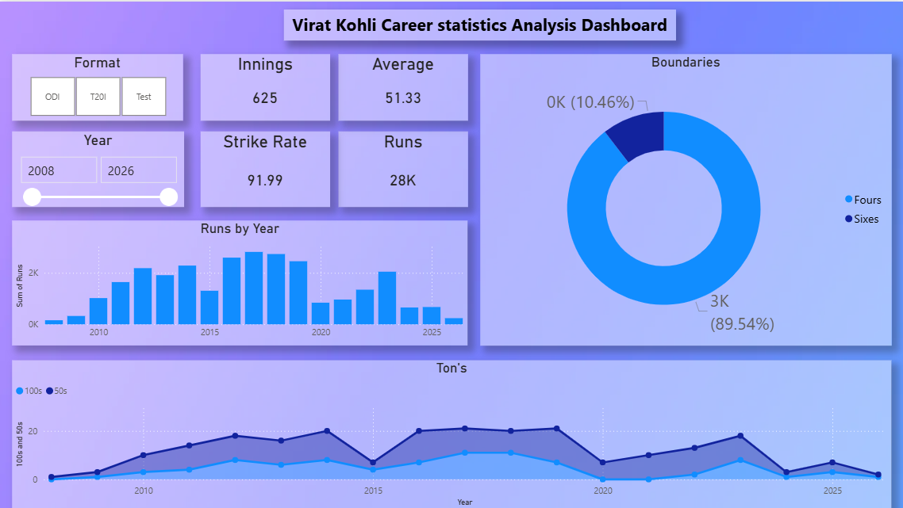

# 📊 Virat Kohli Career Statistics Analysis Dashboard

## 🚀 Project Overview
This project presents an interactive **Virat Kohli Career Statistics Dashboard** built using Power BI.  
It provides a comprehensive analysis of his cricket career across different formats, highlighting performance trends, consistency, and achievements over the years.

---

## 📌 Key Metrics
- 🏏 Innings: 625  
- 📊 Average: 51.33  
- ⚡ Strike Rate: 91.99  
- 🏃 Total Runs: 28K  

---

## 📷 Dashboard Preview

---

## 📊 Features
- 🎯 Format filter (ODI, T20I, Test)  
- 📅 Year filter (2008–2026)  
- 📈 Runs by year analysis  
- 🔥 Strike rate and batting average insights  
- 🎯 Boundary distribution (Fours vs Sixes)  
- 🏆 Performance tracking (100s and 50s over time)  

---

## 🛠️ Tools & Technologies
- Power BI  
- DAX (Data Analysis Expressions)  
- Cricket dataset (CSV/Excel)  

---

## 📊 Insights
- Consistent performance with an average above 50  
- Majority of boundaries are fours (~89%)  
- Peak performance observed between 2016–2019  
- Strong contribution in all formats of the game  

---

⭐ If you like this project, please give it a star!
